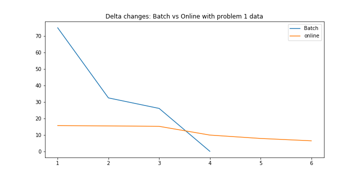

#  Algorithms Description 
## 1) Batch Perceptron Algorithm

#### The perceptron Algorithm is inspired by the biological neural networks (BNN) , where each neuron transmits and recieves various stimulus from all over the body, but there is a condition , ***that this summation stimulus must be over a certian thershold*** to be transmitted to the axon. The perceptron tries to imitate this image in a computational way.

so lets model the perceptron  
1. Perceptron models a neuron 
2. it receives * N * inputs according to the features  
3. it sums those inputs, checks the result and produces an output 
4. checks if the input is above a certain thershold or not and behave accordingly, if the input exceed the threhoshld it will output 1 else it will output 0. This compraison is done by a Transformtion Function  

> The goal of the preceptron is to Find the Corrects weights that will output correct results  

5. The Transfer Function (Activation Function) translates input into output, and the commonly used is the Sigmoid Function 
6. Also we add a term called "Bias" to shift the transfer function horizontally  
7. The learning rate which controls the changing in both the weights and the bias

>  So to Sum Up, it takes an input which is Training set, aggregates it (weighted sum), and returns 1 only if the aggregated sum is more than some threshold, else returns 0 
>> This Rewrites the threshold and making it a constant input with a variable weight
> u = weights multipled (dot product) by x_training data 

- If y_training multiplied by u (both scalars) <= 0  
- change/update delta 
- Delta = Delta / size of training data (Averaging) 
- Update weights untill we reach an acceptable error percentage

> A key word for the normal Batch perceptron that it uses fixed Training DataSet of fairly small size
---

## 2) Online Training Algorithm

#### They are both pretty similar but the Online Training is used with Large Continous flowing data, On-line learning algorithms take an initial guess model and then picks up one-one observation from the training population and recalibrates the weights on each input parameter.

#### In the online model, you are allowed to make exactly one pass on your data, so these algorithms are typically much faster than their batch learning equivalents, thus deploying online algorithms in production typically requires that you have something constantly passing datapoints to your algorithm.

#### If your data changes and your feature selectors are no longer producing useful output, or if there is major network latency between the servers of your feature selectors, or one of those servers goes down, or really any number of other things, your learner tanks and your output is garbage. 
#### ***Making sure all of this is running ok can be a trial.***

> The main difference between the online and the batch is that the online training processes data piece by piece while the batch perceptron processes the data in batches , hence the name  
>
> So to sum up, The online algorithm Takes input which is large continous training dataset(this wasnt applied in our problem), then get:  
>> u = weights multipled (dot product) by x_training data 

- if  y_training multiplied by u (both scalars) <= 0 
	- change/update delta 
	- Delta = Delta / size of training data (Averaging) 
	- Update weights 
- Untill we reach an acceptable error we keep iterating 

The weight is updated inside the If statment to make the test one by one not as a batch

---

#  Algorithms Implementation 

## 1) Batch Perceptron function

- The plots array is used to append the norm of deltas while iterating to plot them later against deltas generated from the online function
- The epochs variable is calculated here only for the breaking out of the function in case of too many iteration (Not linearly sperable data)
- other than that the epochs in the batch algorithm is equal to length of weight_steps, so we don't have to return it
---

## 2) Online Training Algorithm

- In the on-line function on the other hand, number of epochs has to be calculated since it isn't equal to length of weight_steps
- I also use it here to break out of the function as well at 1000 iterations 

---

#  Comparisons from sheet 3

## 1) Problem 1 data

- As mentioned before, in the batch algorithms the Epochs is the same as the number of times the weights changed    

- We can clearly see that the number of weights changes here is darastically less than the batch algorithm one
- also the number of epochs is less than the number of weights changes here as expected from the algorithm    

 
  
---

## 2) Problem 4 data

- Using this data, the batch calculated the weights very fast since the data was easy to calculate from    

- The batch he was faster than the on-line, which could be from the random weights were initialized better in the batch or since the data is very small it complements the batch algorithm method    

  
---

#  Generated data from SkLearn

- We will make 2 comparisons here: 
	- The 1st will be with linearly sperable data where the accuracy should be very high in both train and test data
	- The 2nd will be with non-linearly sperable data and see how much error the model will reach

## 1) linearly sperable data

   

   

  

---

## 1.1) Accuracy Calculations

Here is the data that was generated, which seems very easy for the model to learn from  

   

Now we will plot both models against the test & train data  

   

   

Finally we calculated for train and test data using both models: confusion matrix, accuracy  
The 1st cell is for the batch model, while the second cell is for the on-line model  

   

 

> Since the data was easy to learn, both models achieved 100% accuracy on both test and train data

  

---

## 2) non-linearly sperable data

Since the data is not sperable linearly, the model will break at the condition of 10000 & 1000 epochs for batch and on-line respectively

   

   

  

---

## 2.1) Accuracy Calculations

This time we have data which will be very hard to learn on, since it can't be seperated linearly  

   

After plotting both models against the test & train data, we can see that the model didn't seperate the data correctly  

   

   

Finally we calculated for train and test data using both models: confusion matrix, accuracy  
The 1st cell is for the batch model, while the second cell is for the on-line model  

   

   

> Since the data was hard to learn, both models achieved lower accuracy on both test and train data than on the linearly sperable data

---
