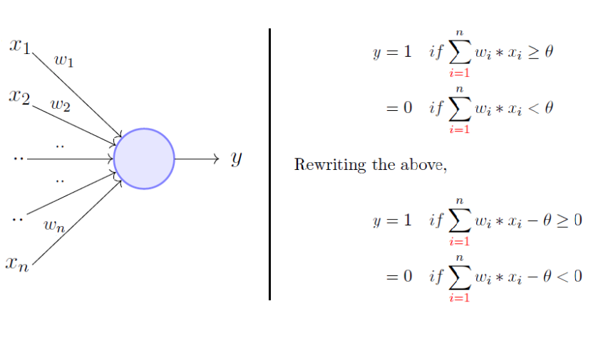

# How The Algorithm Works
## 1-Batch Perceptron Algorithm

---
The perceptron Algorithm is inspired by the biological neural networks (BNN) , where each neuron transmits and recieves various stimulus from all over the body, but there is a condition , **that this summation stimulus must be over a certian thershold** to be transmitted to the axon. The perceptron tries to imitate this image in a computational way.

so lets model the perceptron  
1. Perceptron models a neuron 
2. it receives * N * inputs according to the features  
3. it sums those inputs ,checks the result and produces an output 
4. checks if the input is above a certain thershold or not and behave accordingly, if the input exceed the threhoshld it will output 1 else it will output 0. this compraison is done by a Transformtion Function  
> The goal of the preceptron is to Find the Corrects weights that will output correct results  

5-The Transfer Function (Activation Function) translates input into output, and the commonly used is the Sigmoid Function 
6-Also we add a trem called "Bias" to shift the transfer function horizontally  
7-  the learning rate which controls the changing in both the weights and the bias
>  So to Sum Up,It takes an input which is Training set, aggregates it (weighted sum) and returns 1 only if the aggregated sum is more than some threshold else returns 0. Rewriting the threshold and making it a constant input with a variable weight,   u = weights multipled (dot product) by x_training data 
   if  y_training multiplied by u (both scalars) <= 0  
   change/update delta 
Delta = Delta / size of training data (Averaging) 
Update weights
               untill we reach an acceptable error percentage

>A key word for the normal Batch perceptron that it uses fixed Training DataSet of fairly small size
---

## 2-Online Training Algorithm

They are both pretty similar but the Online Training is used with Large Continous flowing data,On-line learning algorithms take an initial guess model and then picks up one-one observation from the training population and recalibrates the weights on each input parameter,In the online model, you are allowed to make exactly one pass on your data, so these algorithms are typically much faster than their batch learning equivalents,Deploying online algorithms in production typically requires that you have something constantly passing datapoints to your algorithm. If your data changes and your feature selectors are no longer producing useful output, or if there is major network latency between the servers of your feature selectors, or one of those servers goes down, or really, any number of other things, your learner tanks and your output is garbage. Making sure all of this is running ok can be a trial.

> So the main difference between the online and the batch , is that the online training processes data piece by piece while the batch perceptron processes the data in batches , hence the name  

> so to sum up, The online algorithm Takes input which is large contionus training dataset(this wasnt applied in our problem), then we   u = weights multipled (dot product) by x_training data 
		    if  y_training multiplied by u (both scalars) <= 0 
			    change/update delta 
			    Delta = Delta / size of training data (Averaging) 
			    Update weights 
Untill we reach an acceptable error 
The weight is updated inside the If statment to make the test one by one not as a batch
